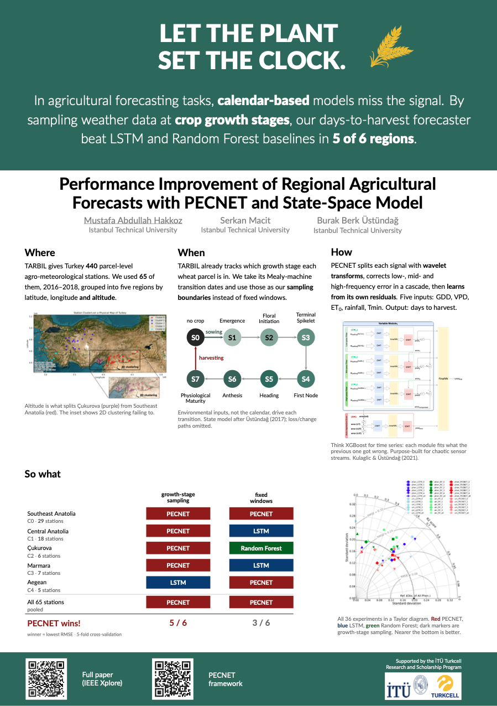

# betterposter

A [Claude Code](https://claude.com/claude-code) skill that turns a paper into a
print-ready **A0 conference poster**.

You hand Claude the paper. It picks the one result worth a headline, writes the
poster, builds the PDF, and checks it against the things that only show up after
you have paid the print shop. You review and argue with the wording — you do not
lay anything out, and you do not touch LaTeX.

<p align="center">
  
</p>

<p align="center"><sub>Built from one paper PDF — see <a href="#an-example">An example</a>.</sub></p>

## The format

**#betterposter** is Mike Morrison's answer to the poster nobody reads. One finding,
in plain language, big enough to land from three metres away. Everything else — the
method, the tables, the caveats — demotes to a narrow supporting column and a QR
code.

The point is that a poster session is not a reading room. The poster's job is to
*stop* someone walking past; the depth comes from your mouth once they have stopped,
or from behind the QR after they have left. That is a content problem, not a design
problem, and it is the part this skill spends most of its effort on.

The format and the LaTeX class are other people's work — see [Credits](#credits).
This repository is the machine that drives them.

## Install

**As a plugin** (recommended — one command, and you get updates):

```
/plugin marketplace add mustafahakkoz/claude-betterposter
/plugin install betterposter@mustafahakkoz
```

**Or manually**, as a personal skill:

```bash
git clone https://github.com/mustafahakkoz/claude-betterposter.git
ln -s "$PWD/claude-betterposter/skills/betterposter" ~/.claude/skills/betterposter
```

You will also need a TeX engine and the two tools the checks use:

```bash
brew install tectonic poppler zbar
python3 -m pip install Pillow
```

Tectonic is a Homebrew *formula*, so it installs without `sudo`. A local TeX Live
works too.

## Use

Point Claude at the paper:

> Build an A0 poster from `paper.pdf` for a conference board.

The first thing back is a proposed **main finding** — one sentence, no jargon. That
sentence *is* the poster, so it is the one decision worth spending time on. Once it
is agreed, the skill sets up the project, writes the supporting columns, places the
figures, builds the PDF and runs the checks.

Already have a poster and just want it vetted?

> Check this poster before I send it to print.

Or invoke it directly with `/betterposter`.

## What it is actually doing

Two jobs, and the second one is the reason this exists.

**Writing the poster.** Poster copy is written from scratch; paper text never
transfers, because prose that works in a two-column PDF is unreadable at 3 metres.
The budget is hard — 150–250 prose words, one sentence for the finding, three short
supporting blocks, two or three figures. Claims get checked back against your own
tables, because an abstract is usually phrased more strongly than the data supports,
and on a poster that sentence stands alone in front of someone who has just read the
table next to it.

**Catching the failures that are invisible on screen.** The poster class is capable
but fails *quietly*: a build exits 0 while it has embedded the wrong fonts, blanked
your QR codes, or spilled onto a second page you cannot see. Twelve of those failure
modes are documented, with the fix for each, and five of them are checked mechanically
before you print:

```
$ python3 scripts/check_poster.py

[OK  ] size      841.0 x 1189.0 mm, 1 page(s)
[OK  ] words     233 prose words (ceiling 250)
[OK  ] figures   worst: 168 ppi (floor 120)
[OK  ] fonts     embedded Lato-Regular, Lato-Bold, Lato-Light, Lato-Black
[OK  ] qr        both codes decode to the right URLs
```

Each catches something you cannot see in a PDF viewer: a phantom blank page, a raster
that is under-resolution *at the size it is actually placed*, a silent fallback to
the wrong font, and a QR code that renders but will not scan. Paper size, column
width, font cuts and QR URLs are all read out of the project, so the checker runs
unmodified on any poster.

Every number the skill relies on came from compiling a real A0 poster and measuring
the render — not from a spec sheet. Several are counterintuitive enough that guessing
gets them wrong.

## An example

The poster above was built this way, from a single input: [*Performance Improvement of
Regional Agricultural Forecasts with PECNET and State-Space
Model*](https://ieeexplore.ieee.org/abstract/document/10661077), a 6-page paper from
Agro-Geoinformatics 2024. The output is a native A0 PDF, 841 × 1189 mm, one page.

What the automation had to decide, and what it settled on:

| | |
|---|---|
| **The finding** | "Let the plant set the clock." — the paper's actual contribution, stripped of every domain term |
| **The support** | three columns answering *Where*, *When*, *How*, at 233 prose words total |
| **The evidence** | one results table won on a countable claim ("5 of 6 regions") rather than an average |
| **The detail** | two QR codes — the paper on IEEE Xplore, and the framework's repository |

Neither file ships here — the paper is under IEEE copyright, and the poster is 4 MB
that every install would otherwise download. The link above is the input if you want
to read it, though Xplore paywalls the PDF for anyone without a subscription. To try
the skill, point it at a paper of your own; that is what it is for.

## What's inside

| | |
|---|---|
| `SKILL.md` | the workflow, and the four traps that silently corrupt a build |
| `references/class-traps.md` | twelve silent failures, with the fix for each |
| `references/design.md` | contrast, typography, content rules, figures, vertical budget |
| `references/class-reference.md` | the class API and the geometry for A0/A1/A2 |
| `references/setup.md` | template choice, licence, toolchain, QR codes |
| `scripts/check_poster.py` | the five pre-print checks, auto-configured from the project |
| `scripts/contrast.py` | WCAG ratios, colour-mix arithmetic, ramps, PDF sampling |
| `assets/main.tex` | a starter that compiles, with every trap pre-fixed |
| `assets/Makefile` | build, watch, clean, check |

## Credits

**The #betterposter format is Mike Morrison's**, along with the original PowerPoint
template and the [talk that started it](https://osf.io/ef53g/). Nothing here improves
on that design.

The LaTeX class this builds on, and its lineage:

| | |
|---|---|
| **Mike Morrison** ([@mikemorrison](https://twitter.com/mikemorrison)) | the #betterposter design and the original template |
| **Rafael Bailo** ([betterposter-latex-template](https://github.com/rafaelbailo/betterposter-latex-template)) | the landscape LaTeX port, `betterposter.cls`, GPL-3.0 |
| **Daniel Bradford** ([Overleaf](https://www.overleaf.com/latex/templates/better-portrait-poster-template/rnfzsnvbhxgr)) | the portrait adaptation this skill drives, `betterportraitposter.cls` |

The `.cls` header names all three; keep it intact.

**The skill is [Mustafa Abdullah Hakkoz](https://github.com/mustafahakkoz)'s** — the
automation around that class: the paper-to-poster workflow, the measurements, the
twelve documented failure modes, the verification scripts and the starter. The class
itself is neither bundled nor modified here.

## Licence

The skill — the starter `main.tex`, both scripts, the Makefile and all the prose — is
**MIT**. See [LICENSE](LICENSE). None of it is derived from the poster class.

**The class is not bundled**, deliberately; the skill fetches it into your project
instead. Line 2 of the `.cls` header says **GNU GPL-3.0**, as does Bailo's landscape
class that it is built on, while the Overleaf listing for the same template records
CC BY 4.0. The two disagree. The header travels with the file you actually vendor, so
treat the class as GPL-3.0 and say so in your poster's README.

Bradford has no public GitHub repository, so the class is fetched from
[machml/Better-Portrait-Scientific-Poster-Template](https://github.com/machml/Better-Portrait-Scientific-Poster-Template),
a third-party re-upload carrying no `LICENSE` file. The
[Overleaf template page](https://www.overleaf.com/latex/templates/better-portrait-poster-template/rnfzsnvbhxgr)
is the canonical source.

## Contributing

Corrections are welcome, especially measured ones. If a claim here contradicts your
own render, please open an issue with the measurement — that is how every number in
this skill got here.
